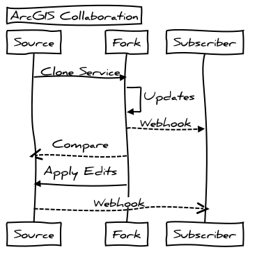

## Collaborative GIS Editing


```
Title: ArcGIS Collaboration
Source->Fork: Clone Service
Fork->Fork: Updates
Fork-->Subscriber: Webhook
Fork-->>Source: Compare
Fork->Source: Apply Edits
Source-->>Subscriber: Webhook
```



